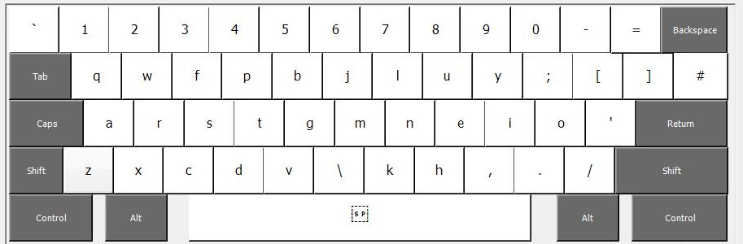
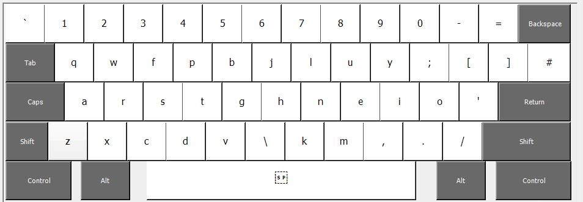
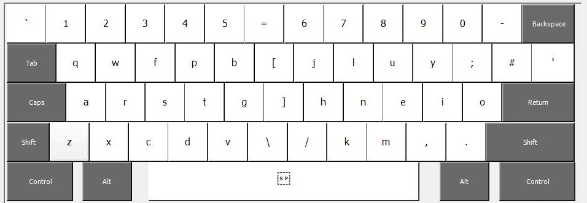
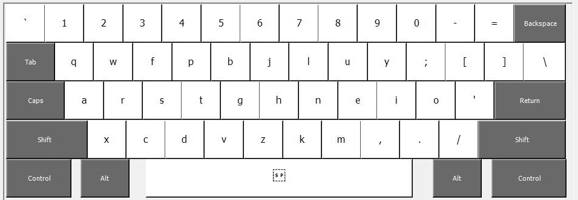
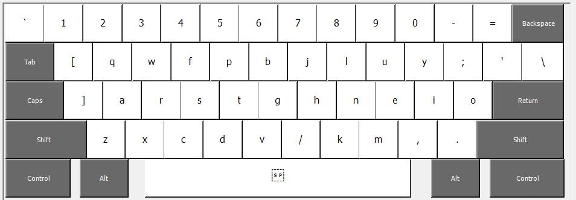

Colemak Mod-DH
==============

**See the [Colemak Mod-DH Project Home Page](http://colemakmods.github.io/mod-dh/ "Colemak Mod-DH") for information.**

## KLC files

There are currently a selection of files for [Microsoft Keyboard Layout Creator](http://msdn.microsoft.com/en-GB/goglobal/bb964665.aspx "Keyboard Layout Creator") (KLC). To use, load them into Keyboard Layout Creator and use the menu option "Project > Build DLL and Setup Package".

### ISO (UK) keyboard

[Download UK Mod-DH (full)](klc/uk-ck-moddh-full.klc?raw=true)

[Download UK Mod-DH (left)](klc/uk-ck-moddh-left.klc?raw=true)

[Download UK Mod-DH (full, wide)](klc/uk-ck-moddh-full-wide.klc?raw=true)

[Download UK Mod-DH (left, wide)](klc/uk-ck-moddh-left-wide.klc?raw=true)

### ANSI (US) keyboard

[Download US Mod-DH (full)](klc/us-ck-moddh-full.klc?raw=true)

[Download US Mod-DH (left)](klc/us-ck-moddh-left.klc?raw=true)

[Download US Mod-DH (full, alt)](klc/us-ck-moddh-full-alt.klc?raw=true)

[Download US Mod-DH (left, alt)](klc/us-ck-moddh-left-alt.klc?raw=true)

