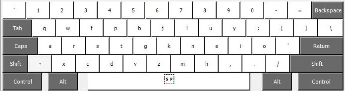
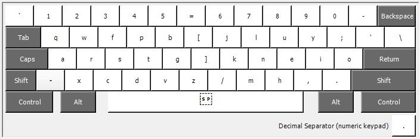
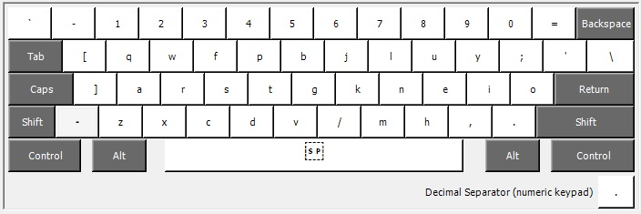
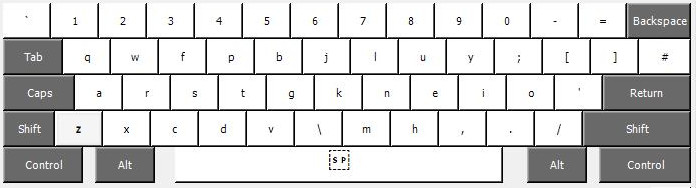
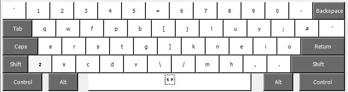

# Colemak Mod-DH for Windows (Microsoft KLC files and Windows Installers)

**These are the Colemak-DHk mappings. See also the standard [Colemak-DH mappings](https://github.com/ColemakMods/mod-dh/tree/master/klc)**.

Microsoft has created a tool called [Keyboard Layout Creator](https://www.microsoft.com/en-us/download/details.aspx?id=102134 "Keyboard Layout Creator") (KLC) which allows users to generate their own keyboard mapping files. The tool also allow you to generate a "setup.exe" installer file if you want to install the layout into the operating system.

To use a KLC file, load it into Keyboard Layout Creator and use the menu option "Project > Build DLL and Setup Package". 

**Quick start:** Pre-generated installer files are available in the zip packages listed below.

## ANSI (US) keyboard  

**US ANSI Colemak-DHk:**  
[Download KLC](colemak_dhk_ansi_us.klc?raw=true)  
[Download zip](colemak_dhk_ansi_us.zip?raw=true)  
  

**US ANSI Colemak-DHk Wide:**  
[Download KLC](colemak_dhk_ansi_us_wide.klc?raw=true)  
[Download zip](colemak_dhk_ansi_us_wide.zip?raw=true)  
  

**US ANSI Colemak-DHk "A-wing":**  
[Download KLC](colemak_dhk_ansi_us_awing.klc?raw=true)  
[Download zip](colemak_dhk_ansi_us_awing.zip?raw=true)  
  

## ISO (UK) keyboard

**UK ISO Colemak-DHk:**  
[Download KLC](colemak_dhk_iso_uk.klc?raw=true)  
[Download ZIP](colemak_dhk_iso_uk.zip?raw=true)  
  

**UK ISO Colemak-DHk (wide):**  
[Download KLC](colemak_dhk_iso_uk_wide.klc?raw=true)  
[Download zip](colemak_dhk_iso_uk_wide.zip?raw=true)  
  

