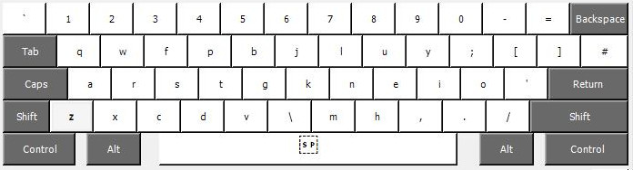
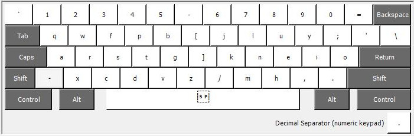
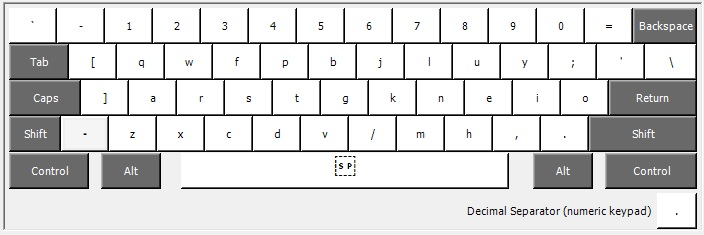

# Colemak Mod-DH for Windows (Microsoft KLC files)

Microsoft has created a tool called [Keyboard Layout Creator](http://msdn.microsoft.com/en-GB/goglobal/bb964665.aspx "Keyboard Layout Creator") (KLC) which allows users to generate their own keyboard mapping files. The tool also allow you to generate a "setup.exe" installer file if you want to install the layout into the operating system.

To use a KLC file, load it into Keyboard Layout Creator and use the menu option "Project > Build DLL and Setup Package". Pre-generated installer files are also available in the zip packages.

## ISO (UK) keyboard

**UK Mod-DH:**  
[Download KLC](moddh-iso-uk.klc?raw=true)  
[Download ZIP](moddh-iso-uk.zip?raw=true)  

**UK Mod-DH (wide):**  
[Download KLC](moddh-iso-uk-wide.klc?raw=true)  
[Download zip](moddh-iso-uk-wide.zip?raw=true)  

## ANSI (US) keyboard  

**US Mod-DH:**  
[Download KLC](moddh-ansi-us.klc?raw=true)  
[Download zip](moddh-ansi-us.zip?raw=true)  

**US Mod-DH Wide:**  
[Download KLC](moddh-ansi-us-wide.klc?raw=true)  
[Download zip](moddh-ansi-us-wide.zip?raw=true)  

**US Mod-DH (alternative home):**  
[Download KLC](moddh-ansi-us-alt.klc?raw=true)  
[Download zip](moddh-ansi-us-alt.zip?raw=true)  

## Matrix keyboard  

KLC does not specifically support matix-style keyboards, but this configuration assumes standard scan codes in a matrix layout, and uses the [Mod-DH Matrix mapping.](http://colemakmods.github.io/mod-dh/keyboards.html#matrix-keyboards). You also may want to use this configuration if you prefer Mod-DH rev 1.

**Matrix Mod-DH:**  
[Download KLC](moddh-ansi-us.klc?raw=true)
