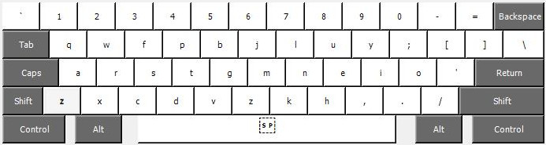
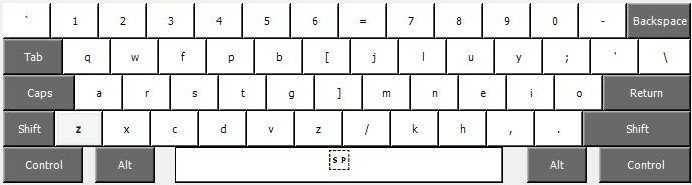
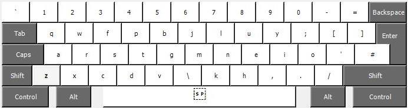
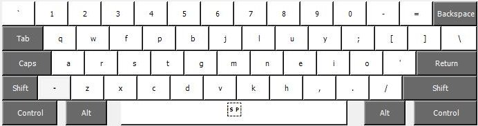

# Colemak Mod-DH for Windows (Microsoft KLC files and Windows Installers)

Microsoft has created a tool called [Keyboard Layout Creator](https://www.microsoft.com/en-us/download/details.aspx?id=102134 "Keyboard Layout Creator") (KLC) which allows users to generate their own keyboard mapping files. The tool also allow you to generate a "setup.exe" installer file if you want to install the layout into the operating system.

To use a KLC file, load it into Keyboard Layout Creator and use the menu option "Project > Build DLL and Setup Package". 

**Quick start:** Pre-generated installer files are available in the zip packages listed below.

## ANSI (US) keyboard  

**US ANSI Colemak-DH:**  
[Download KLC](colemak_dh_ansi_us.klc?raw=true)  
[Download zip](colemak_dh_ansi_us.zip?raw=true)  
  

**US ANSI Colemak-DH Wide:**  
[Download KLC](colemak_dh_ansi_us_wide.klc?raw=true)  
[Download zip](colemak_dh_ansi_us_wide.zip?raw=true)  
  

**US ANSI Colemak-DH "A-wing":**  
[Download KLC](colemak_dh_ansi_us_awing.klc?raw=true)  
[Download zip](colemak_dh_ansi_us_awing.zip?raw=true)  
  

## ISO (UK) keyboard

**UK ISO Colemak-DH:**  
[Download KLC](colemak_dh_iso_uk.klc?raw=true)  
[Download ZIP](colemak_dh_iso_uk.zip?raw=true)  
  

**UK ISO Colemak-DH (wide):**  
[Download KLC](colemak_dh_iso_uk_wide.klc?raw=true)  
[Download zip](colemak_dh_iso_uk_wide.zip?raw=true)  
  

## Matrix keyboard  

KLC does not specifically support matix-style keyboards, but this configuration assumes standard scan codes in a matrix layout, and uses the [Colemak-DH Matrix mapping.](http://colemakmods.github.io/mod-dh/keyboards.html#matrix-keyboards). This layout file is NOT recommended on standard, staggered keyboards at it will not correctly apply the [Angle Mod](https://colemakmods.github.io/ergonomic-mods/angle.html).

**Matrix Colemak-DH:**  
[Download KLC](colemak_dh_matrix_us.klc?raw=true)  
[Download zip](colemak_dh_matrix_us.zip?raw=true)  
  

